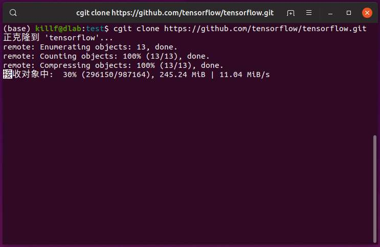
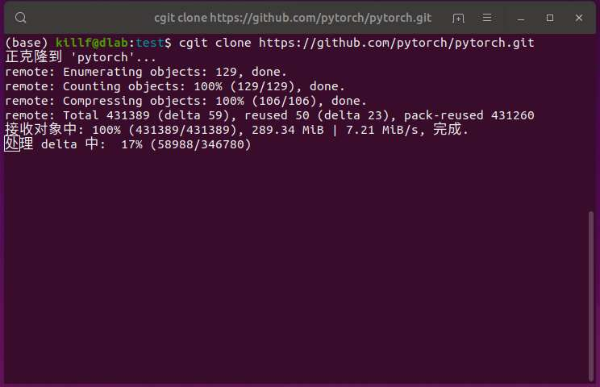

# cgit

> cgit是一个github快速下载器，使用国内镜像，clone速度可达10M/s。

### 一、安装方法

目前，已提供了Ubuntu和Mac的预编译程序，如果使用的是其他系统，可以采用源码编译安装。

**linux下安装**
```shell script
sudo wget http://cgit.killf.info/cgit_linux_latest -O /usr/local/bin/cgit && sudo chmod 755 /usr/local/bin/cgit
```

**mac下安装**
```shell script
sudo wget http://cgit.killf.info/cgit_mac_latest -O /usr/local/bin/cgit && sudo chmod 755 /usr/local/bin/cgit
```

**arm下安装**
```shell script
sudo wget http://cgit.killf.info/cgit_arm_latest -O /usr/local/bin/cgit && sudo chmod 755 /usr/local/bin/cgit
```

**编译安装**
```shell script
git clone https://github.com/killf/cgit.git && sudo ./cgit/install.sh
```

### 二、使用方法

cgit运行时与需要使用git，因此需要先安装git，如果需要使用其他路径的git，可配置环境变量`GIT`，如：

```shell script
export GIT=/usr/bin/git
```

cgit的使用方法git与一样，事实上内部使用的也是git，使用时只需将命令替换成cgit即可，如下：

```
cgit clone https://github.com/killf/cgit.git
```

### 三、下载速度




